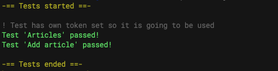
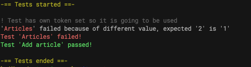

# Apitestium
> Test API's with ease

Tests passed




Tests failed




## How to use apitestium

Create your test json file with all your tests and then run tests

### Structure of test

```javascript
{
    "name": "Name of test",
    "url": "Url to test without the base url",
    "code" 200, // expected status code
    "token": "Bearer ...", // different token then global for that test? can be set to null if unauthorized
    "method": "POST", // post
    "data": { "name": "Damian" } // data to be sent only in POST, PATCH, PUT,
    "expected": { "liked": true } // check for exact value or use the one below to see if it is only present
    "expected": ["liked"] // don't check for value just must be present
}
```

```sh
node apitestium.js tests/your_test.json
```

See tests/test1.json for example. 

## Meta

Damian Balandowski – balandowski@icloud.com